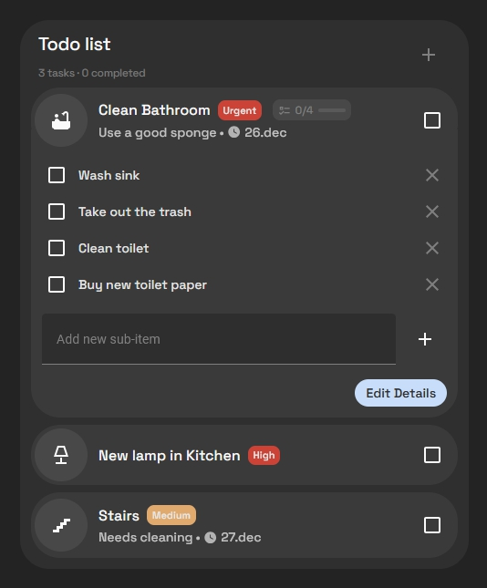

# Todo List Card

A custom Home Assistant dashboard card for managing standard Todo entities. It supports subtasks, different modes for tasks or shopping lists, and various styling options.



## Support development

Buy me a coffee: https://buymeacoffee.com/mysmarthomeblog

Subscribe to Youtube channel: https://www.youtube.com/@My_Smart_Home

## Features

*   **Two Operation Modes:**
    *   **Tasks:** Manage tasks with Priorities (Urgent, High, Medium, Low), Due Dates/Times, and custom Icons.
    *   **Shopping:** Manage lists with Quantities and clickable Links.
*   **Subtasks:** Create nested subtasks for any item.
*   **Visual Editor:** Supports the Home Assistant visual card editor, including mode, sorting, language selection, and default task icon.
*   **Sorting:** Sort by Priority, Due Date, or Title (Ascending/Descending).
*   **Search & Filters:** Optional search button, filter menu, and clear completed button.
*   **Quick Add:** Optional rapid-entry mode for faster task capture.
*   **Auto-complete Parent Tasks:** Automatically complete or reopen a parent task based on subtask status.
*   **Default Task Icon:** Set a custom default icon for task mode.
*   **Custom Styling:** Configure background colors, text colors, and transparency directly from the card config without extra card-mod code.
*   **Translations:** File-based translations with `en.json`, `no.json`, and `de.json`, plus automatic Home Assistant locale detection.
*   **Metadata Storage:** Subtasks and extra details are stored safely within the standard Todo item's description field as JSON.

## New In v1.7.0

*   Added language support with automatic Home Assistant locale detection and bundled `en`, `no`, and `de` translations.
*   Added a configurable default task icon in both YAML and the visual editor.
*   Refactored task priorities to use explicit labels (`urgent`, `high`, `medium`, `low`) while remaining backward compatible with legacy numeric priorities.
*   Added optional quick add, search button, filter menu, and clear completed controls.
*   Added parent task auto-complete behavior based on subtask completion.
*   Improved the visual editor and documentation for the newer configuration options.

## Installation

### Option 1: HACS (Custom Repository)

1.  Go to **HACS** > **Frontend**.
2.  Click the **3 dots** in the top right corner and select **Custom repositories**.
3.  Paste the URL of this repository into the **Repository** field.
4.  Select **Dashboard** as the **Category**.
5.  Click **Add**.
6.  Click on the new "Todo List Card" card in the list and click **Download**.
7.  Refresh your browser.

### Option 2: Manual Installation

1.  Download `todo-card.js` and the `translations/` folder to your `<config>/www/` folder.
2.  Add the resource to your Dashboard configuration:
    ```yaml
    resources:
      - url: /local/todo-card.js
        type: module
    ```

## Configuration

This card supports the visual editor. Simply add a "Custom: Todo List Card" to your dashboard and configure it using the UI.

### YAML Configuration

If you prefer YAML, here are the available options:

```yaml
type: custom:todo-list-card
entity: todo.my_list
title: My Tasks
mode: tasks
sort_by: priority
sort_order: asc
default_task_icon: mdi:hammer
language: auto
show_priority: true
auto_complete_parent: false
confirm_delete: true
quick_add: false
show_filter_menu: true
show_search_button: true
show_clear_button: true
```

### Translation files

Translations are stored in separate JSON files in the `translations/` folder:

*   `translations/en.json`
*   `translations/no.json`
*   `translations/de.json`

Set `language: auto` to follow the Home Assistant UI language, or choose a fixed language in the card editor.
